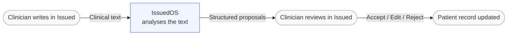

# How It Works: Overview

## Two systems, one product

Issued is actually two separate systems working in tandem. **Issued** is the interface — the web app where clinicians write notes, review patient issues, and manage handover. **IssuedOS** is the intelligence layer underneath it — the system that reads clinical text, reasons about it, and proposes structured changes.

Think of it like a hospital department and its consulting service. The ward team (Issued) does the clinical work and holds the patient record. The consulting service (IssuedOS) receives referrals, analyses the information it is given, and sends back a structured opinion. Crucially, the consulting service never writes in the patient's notes directly — it only ever makes recommendations. The ward team decides what to do with them.

IssuedOS never touches the database or the user interface directly. Everything it does passes through a clearly defined contract — a structured request in, a structured response out. This boundary is intentional. It keeps the two systems independently testable, and it means there is never a pathway for AI to modify clinical data without a clinician in the loop.

---

## What is an "agent"?

An agent is a specialist AI that does one specific job. Rather than a single model that tries to do everything at once, IssuedOS uses a team of focused agents — each one responsible for a narrow task it can do well.

The analogy that maps most cleanly onto clinical practice is the specialist registrar. You give them the relevant information; they give you back a structured opinion; and you — the treating clinician — decide what to do with it. You would not let a registrar write in the patient's notes unsupervised on day one, no matter how good they were. The same principle applies here. There are five agents in IssuedOS, each with a specific role in reading and reasoning about clinical text. See the [Agents Reference](agents-reference.md) for details on what each one does.

---

## What is a "mutation"?

A mutation is a proposed change to a patient's record. Not a vague suggestion — a precise, discrete action. Examples include: "Add 'new-onset atrial fibrillation' as an active issue," "Link this troponin result to the chest pain issue," or "Flag this plan item as stale — it has not been progressed in 48 hours."

Each mutation is a reviewable unit. The clinician sees exactly what the AI is proposing — not a paragraph of text to interpret, but a specific, named change with a clear clinical rationale. They can accept it as written, edit the details before accepting, or reject it outright. Nothing is applied to the record until that decision is made.

---

## The confirmation model

Not all mutations carry the same weight. Some proposals — adding a new issue, changing a documented plan — require explicit clinician approval before anything happens. Others are informational: a flag that an issue looks stale, or a note that a concern mentioned in the text does not appear on the active list. These surface for awareness without demanding an immediate decision.

This distinction is not just a design preference. It reflects the regulatory environment that clinical software operates in. Any system that can autonomously modify a patient's clinical record — without the treating clinician knowing — creates a patient safety and legal liability risk that no responsible design should accept. The rule is simple and without exception: IssuedOS never changes clinical data without the clinician knowing.

---

## The living progress note

Each patient in Issued has one evolving document, not a new note written from scratch each day. It has defined sections — History, Examination, Investigations, Issues, and Tasks — and it moves forward with the patient rather than being overwritten or recreated at each shift.

Every change to that document is tracked: who made it, when, and why. If a clinician manually updated the plan, that is recorded. If an AI suggestion was accepted, that is also recorded — including the original suggestion and the agent that generated it. This version history is not an optional audit trail bolted on afterwards. It is a core part of the record, and it exists precisely because in clinical practice, being able to reconstruct what was known and when can be as important as knowing what is true right now.
