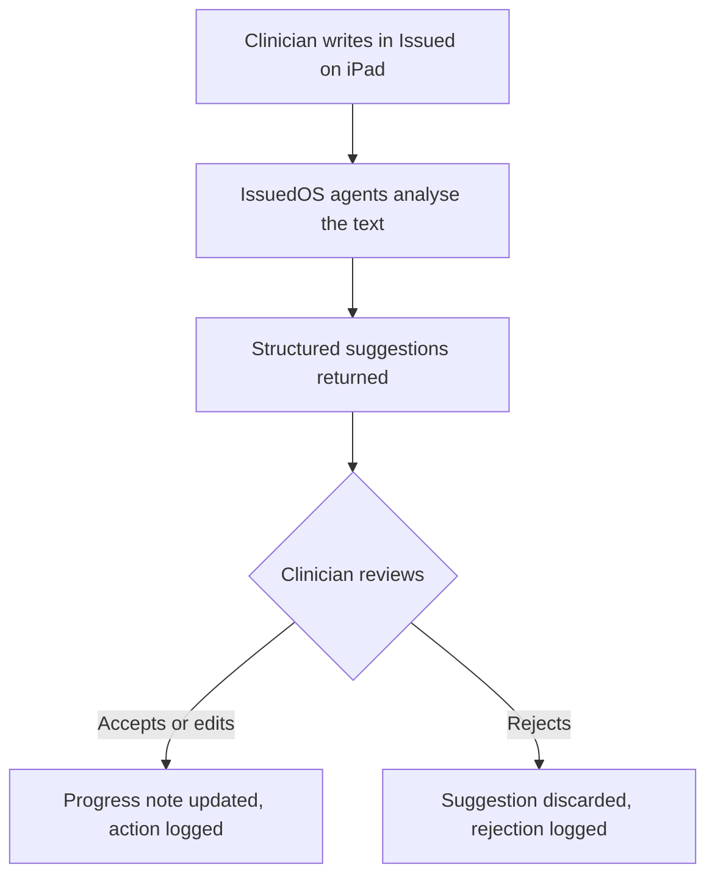

# What is Issued?

Issued is a clinical text editor built for inpatient ward teams. Think of it like Notion for the ward — a single place where clinicians write progress notes, manage patient issues, and prepare handover, all from an iPad at the bedside. Each patient has a live, structured record: their active issues, linked results, and a running clinical narrative. The ward team works together inside it, so everyone sees the same picture, in real time.

IssuedOS is the AI intelligence layer underneath Issued. As clinicians write, IssuedOS agents read the clinical text and propose structured changes — flagging a new issue that emerged in a note, linking a blood result to an existing problem, or surfacing a documentation gap before handover. These are proposals only. IssuedOS never modifies a patient's record on its own; every suggestion is returned to the clinician for review, and nothing is applied until they accept it.

**"AI proposes. Clinicians decide."**

---

## Explore the docs

- [The Problem](the-problem.md) — Why we're building this
- [How It Works](how-it-works/index.md) — The two-system architecture
- [Patient Journey](how-it-works/patient-journey.md) — Follow a patient from admission to handover
- [Safety](safety.md) — How we keep AI in its lane
- [Where We Are](where-we-are.md) — Current status and roadmap
